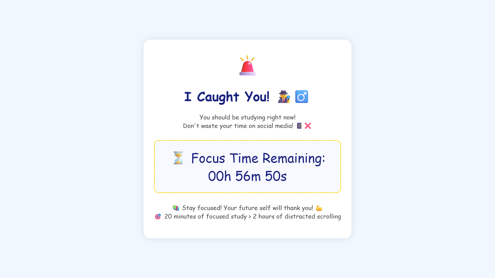

# 🔥 Focus — Ultimate Website Blocker with Live Timer

Take control of your time. Eliminate distractions. Achieve deep focus.

**Focus** is a powerful, lightweight CLI productivity tool that blocks distracting websites and replaces them with a motivational timer page — helping you stay committed to your goals.

No extensions. No heavy apps. Just pure focus.

---

## ✨ Features

* 🚫 Blocks distracting websites (Facebook, Instagram, TikTok, X, WhatsApp, etc.)
* ⏳ Shows a beautiful live countdown timer page instead of the blocked site
* ⚡ Instant activation from Command Prompt
* 🔐 Automatically edits and restores your system hosts file safely
* 🧠 Smart session tracking with status checking
* 🛑 Manual stop support anytime
* 💻 Lightweight and extremely fast
* 🛡 No browser extensions required
* 🎯 Works system-wide across all browsers

---

## 🖼 Preview

Instead of distracting websites, you'll see:

<p align="center">
  
</p>

You see this:

```
🚨 I Caught You!
⏳ Focus Time Remaining: 00h 59m 12s
📚 Stay focused! Your future self will thank you!
```

---

## 🚀 Installation

### 1. Clone or download project

```
git clone https://github.com/yourusername/focus.git
```

or place files in:

```
C:\focus\
```

---

### 2. Install Node.js

Download and install:

https://nodejs.org

---

### 3. Add to PATH

Run CMD as Administrator:

```
setx PATH "%PATH%;C:\focus"
```

Restart CMD.

---

## ⚡ Usage

### Start focus session

```
focus 60
```

Blocks distracting websites for 60 minutes.

---

### Check remaining time

```
focus status
```

Example:

```
⏳ Remaining: 42m 12s
```

---

### Stop focus session

```
focus stop
```

Restores access immediately.

---

## 🎯 Example Workflow

```
focus 90
```

Now open:

```
facebook.com
```

Instead of social media, you'll see your focus timer page.

Your brain stays locked in.

---

## 🧠 How It Works

Focus safely:

* Creates backup of hosts file
* Redirects distracting domains → localhost
* Runs local server showing timer page
* Automatically restores system after timer ends

No permanent system changes.

---

## 📁 Project Structure

```
focus/
│
├── focus.js          # Main CLI logic
├── focus.cmd         # Command launcher
├── blocked.html      # Timer page UI
└── README.md
```

---

## 🛡 Safety

Focus automatically:

* Backs up hosts file before editing
* Restores original state after session
* Handles crashes safely

Your system remains protected.

---

## 💡 Why Focus?

Distractions destroy productivity.

Focus enforces discipline at the system level.

Perfect for:

* Students
* Developers
* Entrepreneurs
* Deep work sessions
* Exam preparation

---

## 🔮 Future Features

* Custom blocked websites
* Background service mode
* Windows installer
* GUI version
* Cross-platform support (Linux, macOS)

---

## 👨‍💻 Author

Built with precision for productivity.

If this helped you, give it a ⭐ on GitHub.

---

## ⚖ License

MIT License

Free to use, modify, and distribute.

---

## 🧠 Remember

> Discipline beats motivation.

Start your focus session now.

```
focus 60
```

---
